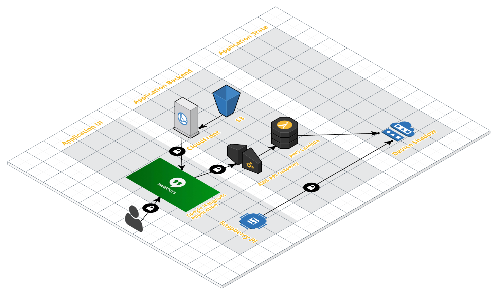

## Meeting Time

We are using Google Hangouts as a meeting platform in our office. Meeting Time is a simple application which implements AWS IoT in a real life situation. 
The purpose of the app is to inform the colleagues around your desk that you are in a meeting.

The application consists of three tiers:

1. A hangouts application which provides web based UI to switch on or off a led connected to a raspberry pi;
  1. Check hangouts-app/README.md
  2. Check device-app/README.md
2. AWS S3 and AWS CloudFront for delivery of the static content to the Google Hangouts Application as well as an AWS Lambda function which handles requests from the hangouts app and updates the AWS IoT things shadow status. This approach provides https transfer of the API data and is very cheap. You are free to use another solution, hosted or serverless.
  * Check serverless/README.md
3. AWS IoT DeviceGateway which provides device and things shadow management;
  1. Go to AWS IoT;
  2. Select Connect and Get Started option;
  3. Select your OS and Nodejs SDK and click Next step;
  4. Set the name of your device and click Next step;
  5. Download connection kit and click Next step;
  6. Configure and test your device;
  7. Use the name of your device to set up serverless.yml in the serverless-app folder;
